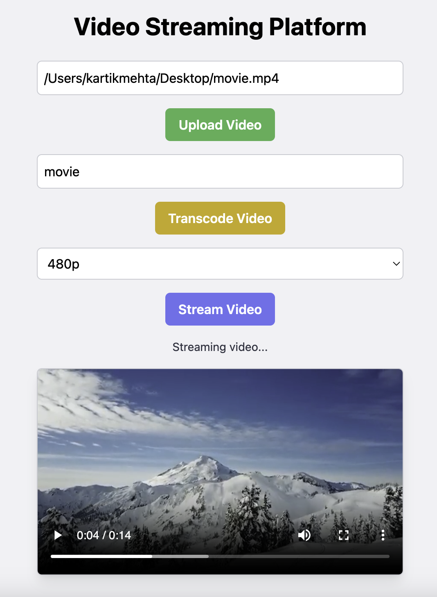

# Video Streaming Platform

This project is a video streaming platform that allows users to **upload videos, transcode them into different resolutions, and stream them in a browser**.

## Features

### Backend
- Upload video files.
- Transcode videos into multiple resolutions (360p, 480p, 720p) using FFmpeg.
- Serve transcoded videos for streaming.

### Frontend
- User-friendly interface to interact with the backend.
- Upload videos via path input.
- Select resolution and stream transcoded videos.

## Usage

### Upload Video
1. In the frontend, enter the path of the video file in the **Upload Video** section.
2. Click the **Upload Video** button.

### Transcode Video
1. Enter the uploaded video name in the **Transcode Video** section.
2. Click the **Transcode Video** button to process the video into multiple resolutions.

### Stream Video
1. Enter the transcoded video name in the **Stream Video** section.
2. Select a resolution (360p, 480p, 720p).
3. Click the **Stream Video** button to play the video in the browser.

## Technologies Used

### Backend
- **Node.js**: JavaScript runtime for the server.
- **Express**: Web framework for the backend.
- **Fluent-FFmpeg**: Video transcoding library.
- **Node-Media-Server**: Media server for streaming.

### Frontend
- **React**: JavaScript library for building user interfaces.
- **Axios**: Promise-based HTTP client for making API calls.
- **TailwindCSS**: Utility-first CSS framework.

## Troubleshooting

1. **CORS Issues**:
   - Ensure CORS middleware is configured in the backend.
   - Use the correct origin in requests (e.g., `http://localhost:3000`).

2. **FFmpeg Not Found**:
   - Verify that FFmpeg is installed and accessible in your system's PATH.
   - Manually set the FFmpeg path in `server.js` if necessary.

3. **Backend or Frontend Not Starting**:
   - Check for missing dependencies and install them using `npm install`.
   - Ensure the ports `4000` (backend) and `3000` (frontend) are not in use.
